# Execution Plan — Spaceship Platform Runner

## Detailed Analysis Summary

### Transformation Scope (Brownfield)
- **Type**: Single-layer application replacement — only `src/app/` changes; `src/engine/` is untouched.
- **Primary Changes**: Delete demo code (Bouncer, Logo, old MainScreen); replace with 3-screen game + all game entities.
- **Related Components**: `main.ts` (screen wiring), `userSettings.ts` (add high-score), `src/app/ui/` (reused as-is).

### Change Impact Assessment
- **User-facing changes**: Yes — the entire app experience changes (game replaces demo).
- **Structural changes**: Yes — new screen hierarchy and game-loop entity structure.
- **Data model changes**: Minimal — one new high-score field added to `userSettings`/localStorage.
- **API changes**: No external APIs.
- **NFR impact**: Performance (60fps physics loop, particle/platform cleanup) — covered in requirements; no new tech stack needed.

### Component Relationships
- **Primary**: `src/app/` (game screens + entities)
- **Stable foundation**: `src/engine/` (unchanged)
- **Entry point**: `main.ts` (wires TitleScreen as first screen)
- **Persistence**: `engine/utils/storage.ts` / `app/utils/userSettings.ts` (extended for high score)
- **No CDK / infrastructure / external services**: pure browser game

### Risk Assessment
- **Risk Level**: Low-Medium
- **Rollback Complexity**: Easy (the engine layer is untouched; reverting app/ restores the template)
- **Testing Complexity**: Manual — build + lint pass, visual play-test in browser; no automated test runner

## Workflow Visualization

```mermaid
flowchart TD
    Start(["User Request"])

    subgraph INCEPTION["INCEPTION PHASE"]
        WD["Workspace Detection\nCOMPLETED"]
        RE["Reverse Engineering\nCOMPLETED"]
        RA["Requirements Analysis\nCOMPLETED"]
        US["User Stories\nSKIP"]
        WP["Workflow Planning\nIN PROGRESS"]
        AD["Application Design\nEXECUTE"]
        UG["Units Generation\nEXECUTE"]
    end

    subgraph UNIT1["UNIT 1: Foundation + Screens"]
        FD1["Functional Design\nSKIP"]
        CG1["Code Generation\nEXECUTE"]
    end

    subgraph UNIT2["UNIT 2: GameScreen"]
        FD2["Functional Design\nEXECUTE"]
        CG2["Code Generation\nEXECUTE"]
    end

    subgraph CONSTRUCTION["CONSTRUCTION PHASE"]
        BT["Build and Test\nEXECUTE"]
    end

    subgraph OPERATIONS["OPERATIONS PHASE"]
        OPS["Operations\nPLACEHOLDER"]
    end

    Start --> WD --> RE --> RA --> US --> WP
    WP --> AD --> UG
    UG --> FD1 --> CG1
    CG1 --> FD2 --> CG2
    CG2 --> BT --> OPS --> End(["Complete"])

    style WD fill:#4CAF50,stroke:#1B5E20,stroke-width:3px,color:#fff
    style RE fill:#4CAF50,stroke:#1B5E20,stroke-width:3px,color:#fff
    style RA fill:#4CAF50,stroke:#1B5E20,stroke-width:3px,color:#fff
    style WP fill:#4CAF50,stroke:#1B5E20,stroke-width:3px,color:#fff
    style AD fill:#FFA726,stroke:#E65100,stroke-width:3px,stroke-dasharray:5 5,color:#000
    style UG fill:#FFA726,stroke:#E65100,stroke-width:3px,stroke-dasharray:5 5,color:#000
    style US fill:#BDBDBD,stroke:#424242,stroke-width:2px,stroke-dasharray:5 5,color:#000
    style FD1 fill:#BDBDBD,stroke:#424242,stroke-width:2px,stroke-dasharray:5 5,color:#000
    style FD2 fill:#FFA726,stroke:#E65100,stroke-width:3px,stroke-dasharray:5 5,color:#000
    style CG1 fill:#4CAF50,stroke:#1B5E20,stroke-width:3px,color:#fff
    style CG2 fill:#4CAF50,stroke:#1B5E20,stroke-width:3px,color:#fff
    style BT fill:#4CAF50,stroke:#1B5E20,stroke-width:3px,color:#fff
    style OPS fill:#BDBDBD,stroke:#424242,stroke-width:2px,stroke-dasharray:5 5,color:#000
    style Start fill:#CE93D8,stroke:#6A1B9A,stroke-width:3px,color:#000
    style End fill:#CE93D8,stroke:#6A1B9A,stroke-width:3px,color:#000

    linkStyle default stroke:#333,stroke-width:2px
```



### Text Alternative (fallback)
```
INCEPTION PHASE:
  Workspace Detection   → COMPLETED
  Reverse Engineering   → COMPLETED
  Requirements Analysis → COMPLETED
  User Stories          → SKIP
  Workflow Planning     → IN PROGRESS
  Application Design    → EXECUTE
  Units Generation      → EXECUTE

CONSTRUCTION PHASE:
  Unit 1: Foundation + Screens
    Functional Design   → SKIP
    NFR Requirements    → SKIP
    NFR Design          → SKIP
    Infrastructure Des. → SKIP
    Code Generation     → EXECUTE
  Unit 2: GameScreen
    Functional Design   → EXECUTE
    NFR Requirements    → SKIP
    NFR Design          → SKIP
    Infrastructure Des. → SKIP
    Code Generation     → EXECUTE
  Build and Test        → EXECUTE

OPERATIONS PHASE:
  Operations            → PLACEHOLDER
```

## Phases to Execute

### INCEPTION PHASE
- [x] Workspace Detection — COMPLETED
- [x] Reverse Engineering — COMPLETED (concise; engine already documented in CLAUDE.md)
- [x] Requirements Analysis — COMPLETED
- [ ] User Stories — **SKIP**
  - *Rationale*: Solo developer, single-player game, one detailed spec, no team collaboration or multi-persona acceptance criteria needed.
- [x] Workflow Planning — IN PROGRESS
- [ ] Application Design — **EXECUTE**
  - *Rationale*: Multiple new components required (3 screens, Ship, Platform, FuelItem, Starfield, JetParticles, World/Physics model). Interface contracts and component responsibilities need definition before coding.
- [ ] Units Generation — **EXECUTE**
  - *Rationale*: Two logically separable units with a clear dependency order (Unit 1 must define navigation & high-score before Unit 2's GameScreen can reference them).

### CONSTRUCTION PHASE — Unit 1: Foundation + Screens
Covers: `GAME_PARAMS`, extended `userSettings` (high score), `main.ts` wiring, `TitleScreen`, `ScoreScreen`.

- [ ] Functional Design — **SKIP**
  - *Rationale*: Screen navigation and high-score persistence are straightforward; no complex business logic beyond what Application Design captures.
- [ ] NFR Requirements — **SKIP**
  - *Rationale*: NFRs already captured in requirements; no new tech-stack decisions.
- [ ] NFR Design — **SKIP** (follows from NFR Requirements skip)
- [ ] Infrastructure Design — **SKIP** (pure browser game; no cloud resources)
- [ ] Code Generation — **EXECUTE**

### CONSTRUCTION PHASE — Unit 2: GameScreen
Covers: `GameScreen` (game loop, camera, ship physics, fuel system, platform generator, collision, game-over), `Ship`, `Platform`, `FuelItem`, `Starfield`, `JetParticleSystem`.

- [ ] Functional Design — **EXECUTE**
  - *Rationale*: Complex physics equations (spec §3), multi-state fuel FSM (consuming/cooldown/charging), procedural platform generation with difficulty scaling, and AABB collision all benefit from explicit design before code.
- [ ] NFR Requirements — **SKIP** (stack already fixed: PixiJS + TypeScript)
- [ ] NFR Design — **SKIP** (follows from NFR Requirements skip)
- [ ] Infrastructure Design — **SKIP** (no infrastructure)
- [ ] Code Generation — **EXECUTE**

### CONSTRUCTION PHASE — Shared
- [ ] Build and Test — **EXECUTE**

### OPERATIONS PHASE
- [ ] Operations — PLACEHOLDER

## Unit Decomposition

| Unit | Contents | Depends On |
|------|----------|-----------|
| **Unit 1: Foundation + Screens** | `GAME_PARAMS`, `highScore` in userSettings, `main.ts` wiring, `TitleScreen`, `ScoreScreen` | Engine (stable) |
| **Unit 2: GameScreen** | `GameScreen`, `Ship`, `Platform`, `FuelItem`, `Starfield`, `JetParticleSystem` | Unit 1 (navigation, high-score) |

## Success Criteria
- **Primary Goal**: A playable mobile-web infinite-runner matching spec.md in full.
- **Key Deliverables**: 3 screens with correct flow, physics/fuel/camera matching spec §3–4, neon visuals, persisted high score.
- **Quality Gates**: `npm run build` passes (no lint/type errors); game is playable and lands/falls correctly on touch.
