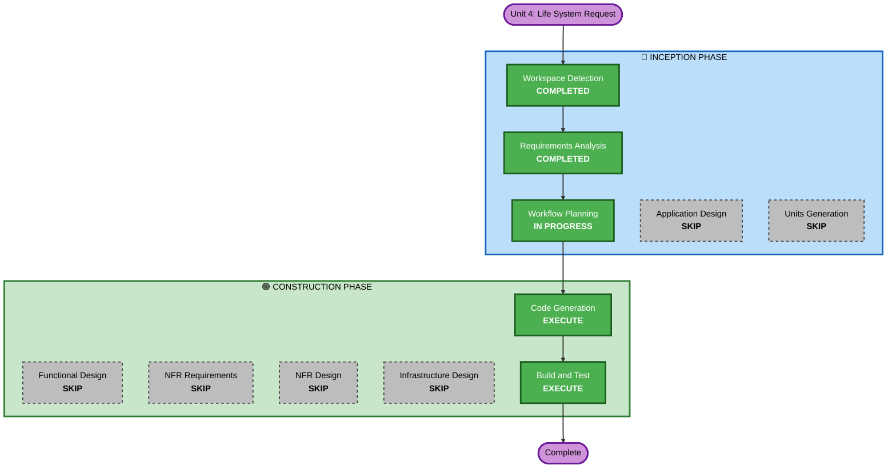

# Unit 4: Life System — Execution Plan

## Detailed Analysis Summary

### Transformation Scope
- **Transformation Type**: Single component enhancement
- **Primary Component**: GameScreen (health state management, damage detection, visual effects)
- **Related Components**: 
  - GAME_PARAMS (new health configuration parameters)
  - Ship class (flashing effect visual feedback)
  - Particle system (smoke particle emissions)
  - UI layer (health bar positioning on right, fuel meter repositioning to left)
- **Change Type**: Additive (new mechanics added to existing system)

### Change Impact Assessment
- **User-facing changes**: YES
  - New health bar UI on right side
  - Visual damage feedback (white/red flashing)
  - Smoke particle effects based on health percentage
  - Game over triggered by health reaching 0
- **Structural changes**: NO (no new components, modular additions to GameScreen)
- **Data model changes**: NO (simple integer health state)
- **API changes**: NO (no interface changes)
- **NFR impact**: NO (performance within existing budget, particle effects reuse existing system)

### Component Relationships
```
GameScreen (primary)
├── Health management (new)
├── Damage detection (collision-based, existing mechanism extended)
├── Visual feedback
│   ├── Flashing effect (Ships class, new)
│   └── Smoke particles (existing particle system, extended)
├── UI layer
│   ├── Health bar (new, right side)
│   └── Fuel meter repositioning (left side)
└── GAME_PARAMS
    └── Health configuration (new)
        ├── maxHealth
        ├── smallDamageThreshold
        ├── smallDamageAmount
        ├── largeDamageThreshold
        ├── largeDamageAmount
        ├── flashing (duration, blink frequency)
        └── smoke (particle counts, thresholds)
```

### Risk Assessment
- **Risk Level**: Low
  - Changes are isolated to GameScreen
  - Reuses existing collision detection mechanism
  - Reuses existing particle system for smoke
  - Reuses existing game over flow (no new code path)
  - All parameters configurable (easy iteration)
- **Rollback Complexity**: Easy (changes are additive, can be reverted cleanly)
- **Testing Complexity**: Simple (straightforward new mechanics)

---

## Workflow Visualization



---

## Phases to Execute

### 🔵 INCEPTION PHASE
- [x] Workspace Detection — COMPLETED
- [x] Requirements Analysis — COMPLETED
- [x] Workflow Planning — IN PROGRESS
- [ ] Application Design — **SKIP**
  - **Rationale**: No new components needed. Health system is a contained addition to GameScreen with no architectural impact. Changes are within existing component boundaries.
  
- [ ] Units Generation — **SKIP**
  - **Rationale**: Already part of Unit 4 planning. Single unit, straightforward implementation path.

### 🟢 CONSTRUCTION PHASE
- [ ] Functional Design — **SKIP**
  - **Rationale**: Requirements document already provides detailed functional specifications (damage tiers, flashing colors, smoke thresholds, UI positioning). Implementation path is clear. Simple, linear mechanics with no ambiguity.

- [ ] NFR Requirements — **SKIP**
  - **Rationale**: No new non-functional requirements. Performance impact minimal (damage calculation at collision time, particle effects reuse existing budget). Existing architecture handles all NFRs.

- [ ] NFR Design — **SKIP**
  - **Rationale**: Depends on NFR Requirements (skipped). Reuses existing particle system and game over flow.

- [ ] Infrastructure Design — **SKIP**
  - **Rationale**: No infrastructure changes. Game runs on same Vite dev server, builds with same npm/vite pipeline. No external services involved.

- [ ] **Code Generation — EXECUTE** ✅
  - **Rationale**: Core implementation. Needs planning (Part 1: detailed steps) then generation (Part 2: code implementation).
  - **Scope**: 
    - Extend GAME_PARAMS with health configuration
    - Modify GameScreen for health state and damage detection
    - Add flashing logic to Ship class
    - Add smoke particle emission logic
    - Reposition UI (health bar right, fuel meter left)
    - Update collision handling to trigger damage

- [ ] **Build and Test — EXECUTE** ✅
  - **Rationale**: Comprehensive verification required. Test all mechanics, UI positioning, parameter tuning.
  - **Test Coverage**:
    - Build passes (lint + tsc + vite)
    - Damage triggers correctly at velocity thresholds
    - Health decreases and displays accurately
    - Flashing effects visible (white/red, correct duration)
    - Smoke particles emit at 25% and 10% thresholds
    - Health bar positioned correctly (right side, gradient colors)
    - Game over transitions smoothly
    - Manual gameplay testing

### 🟡 OPERATIONS PHASE
- [ ] Operations — PLACEHOLDER
  - **Rationale**: Future deployment and monitoring workflows.

---

## Summary of Decisions

| Decision | Rationale |
|---|---|
| **Skip Application Design** | No new components; changes within GameScreen boundaries |
| **Skip Functional Design** | Requirements already detailed; implementation path is clear |
| **Skip NFR Stages** | No new NFRs; existing architecture handles all requirements |
| **Skip Infrastructure Design** | No infrastructure changes; same build pipeline |
| **Execute Code Generation** | Core implementation needed; straightforward planning and generation |
| **Execute Build and Test** | Comprehensive verification of new mechanics and UI changes |

---

## Estimated Timeline
- **Total Phases**: 2 (Code Generation, Build and Test)
- **Estimated Duration**: 
  - Code Generation planning: 15-20 minutes
  - Code generation: 30-40 minutes
  - Build and test: 20-30 minutes
  - Total: ~1.5 hours

## Success Criteria
- **Primary Goal**: Fully functional health system with visual feedback and game over condition
- **Key Deliverables**:
  - [ ] Health parameter configuration in GAME_PARAMS
  - [ ] Damage detection on platform landing (2 tiers)
  - [ ] Health bar UI with gradient colors (right side)
  - [ ] Flashing visual feedback (white/red)
  - [ ] Smoke particle effects (25%/10% thresholds)
  - [ ] Game over flow integration
  - [ ] Fuel meter repositioned (left side)
- **Quality Gates**:
  - [ ] Build passes (lint + tsc + vite)
  - [ ] No TypeScript errors or warnings
  - [ ] All parameters configurable
  - [ ] Manual gameplay testing successful
  - [ ] Zero regressions in existing features

---

## Recommended Execution Path

1. **Code Generation Planning** (Part 1): Create detailed step-by-step implementation plan
2. **Code Generation Execution** (Part 2): Implement health system following approved plan
3. **Build and Test**: Verify all mechanics work correctly, test edge cases, confirm parameters are tunable

**Next Stage**: Code Generation for Unit 4 (Planning phase)

